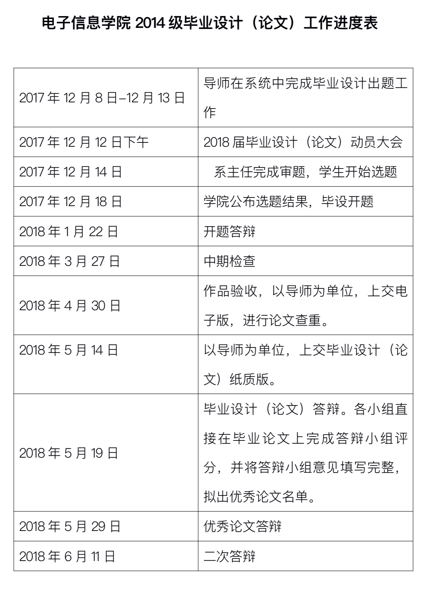

# 毕业设计备忘录  
## 1. 题目 
**《走失人口信息发布、寻找平台“Dai你回家”app》**  
 
## 2. 零碎想法 
*  建立一个备忘录   
 
> 用于记录毕业设计的一些想法和过程。  

* 注意保护平台隐私数据安全   
 
> 平台数据库存储这两种人口的信息，一种是失智人口（走失的高危人群，但目前没有走失）的提前备份，一种是已经走失了的人口信息。管理员（监护人）可以对存储的用户的状态进行设置。平台比对人脸图片的时候只会比对标记为走失的人口信息。且匹配出来的信息只会显示照片和县级的地址（县级一下的地址不显示）以及监护人的电话。

* 平台设置两种权限的账号。

> 一种给政府民政局，可以查询**走失用户**所有的信息；另一种给普通民众，可以查询**走失用户**部分的信息。  

* 平台要记录下所有查询信息记录

## 3. 知识储备 
#### python
#### python web
#### opencv
#### 数据库
#### 加密技术
 
## 4. 学习计划  

## 5. 学校进度安排 
 
